# EBS ボリュームサイズの変更

## 例
インスタンスの非ルートデバイスの EBS ボリュームサイズを 1GiB から 10GiB に拡張します。

## 手順
1. 「EC2 ダッシュボード > インスタンス > インスタンス」を開きます
2. インスタンス一覧から対象インスタンスを選択します
3. 「説明」タブ中の「ブロックデバイス」のうち、非ルートデバイスを開きます
4. EBS ID を開きます
5. 対象ボリュームを選択します
6. 「アクション」をクリックします
7. 「ボリュームの変更」を開きます
8. 現在の「サイズ」が正しいことを確認します
10. 「サイズ」を変更します
11. 「変更」をクリックします
12. 「はい」をクリックします
13. 「閉じる」をクリックします
14. 「サイズ」が変更されていない場合は更新ボタンをクリックします
15. 「サイズ」が正しく変更されたことを確認します

## スクリーンショット

1.
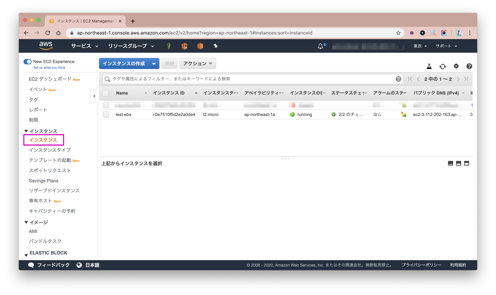
2.
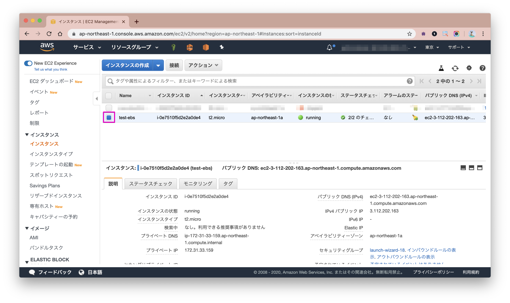
3.
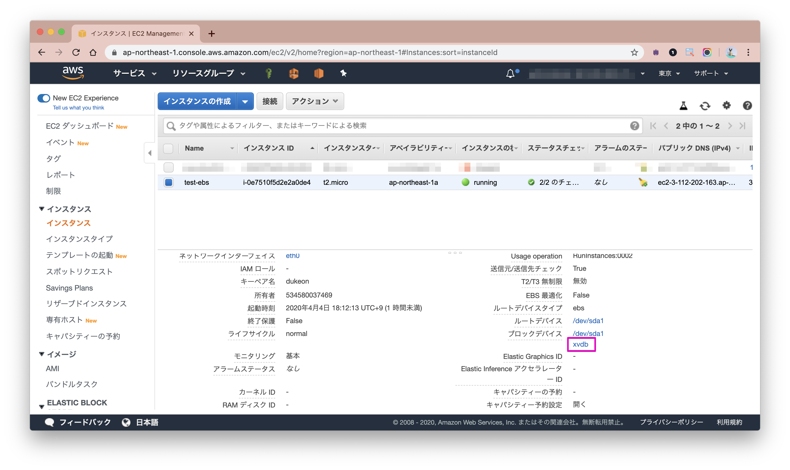
4.
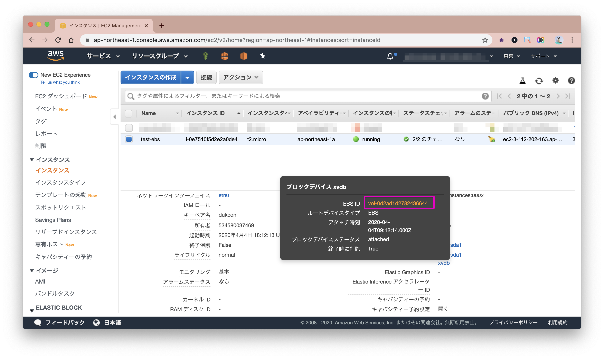
5.
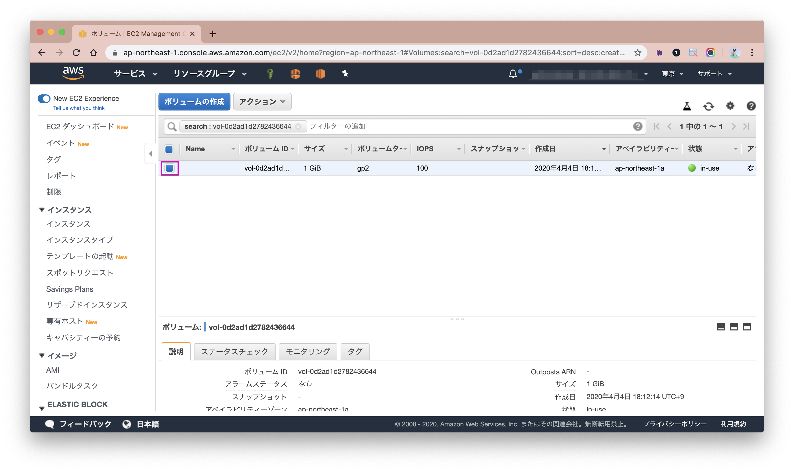
6.
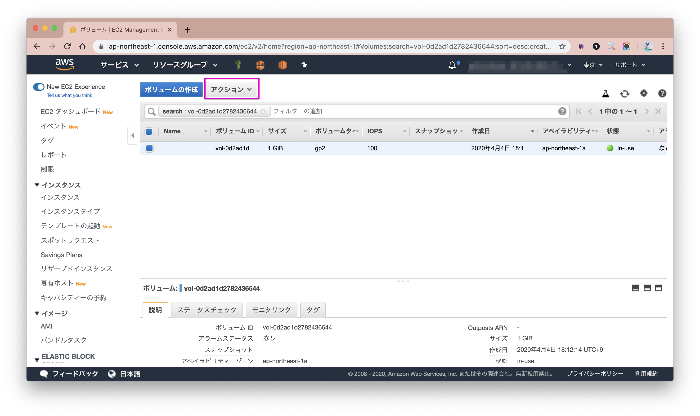
7.
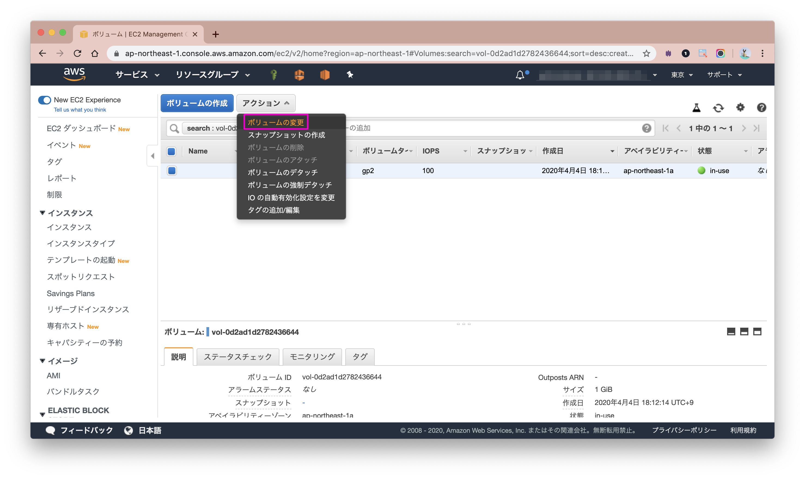
8.

9.
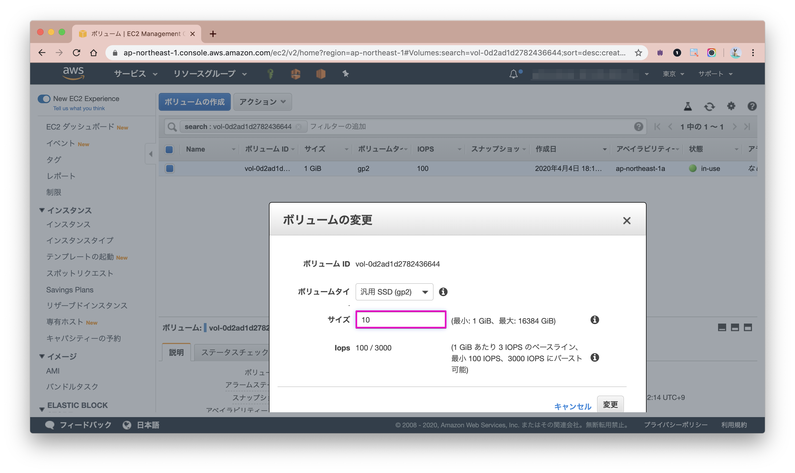
10.
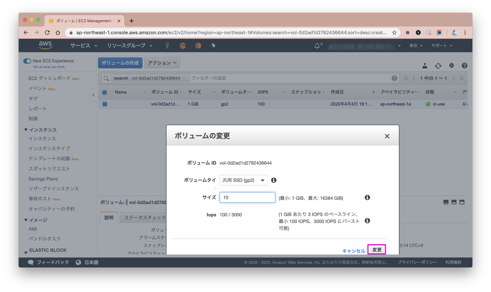
11.
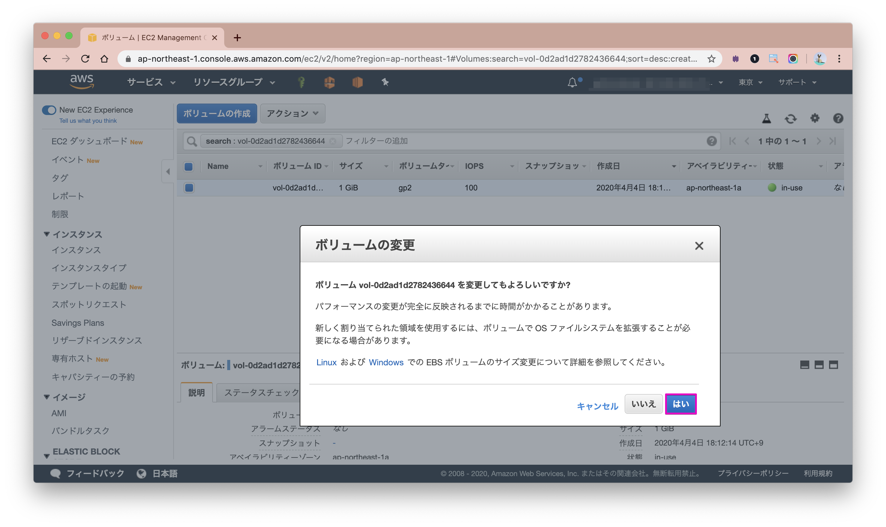
12.
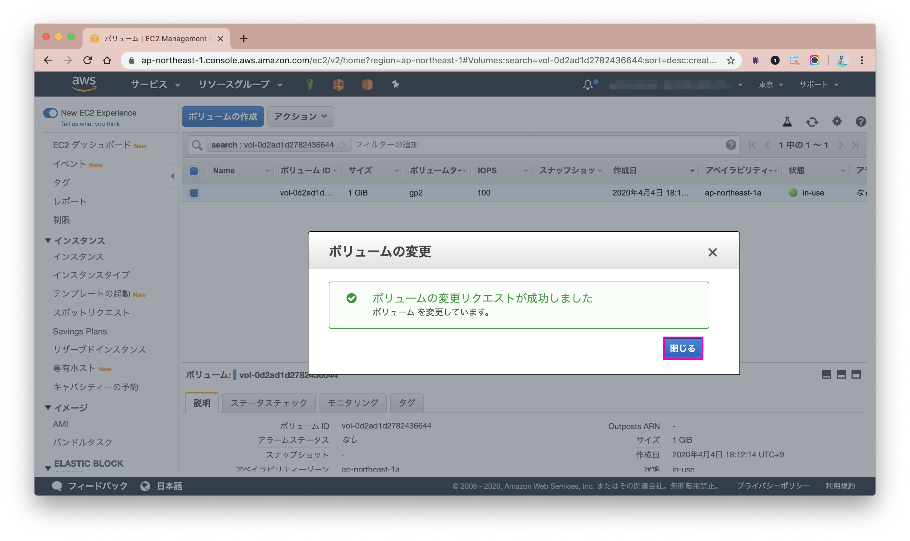
13.
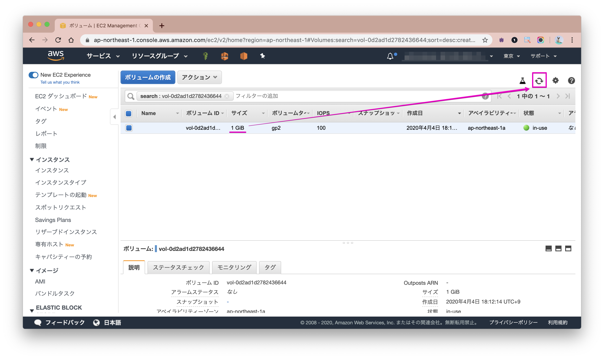
14.
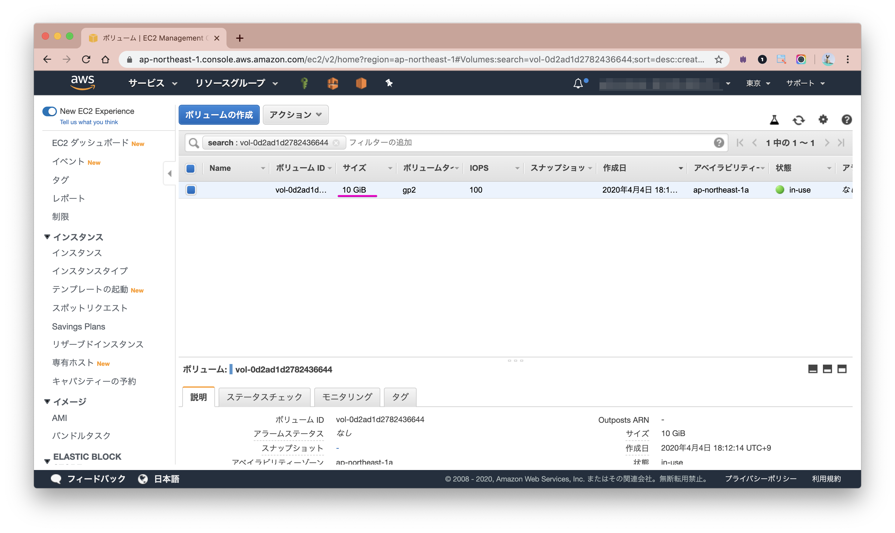

## 参考
https://docs.aws.amazon.com/ja_jp/AWSEC2/latest/UserGuide/ebs-modify-volume.html
