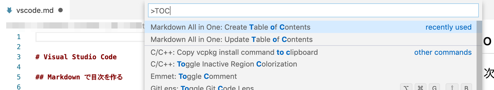
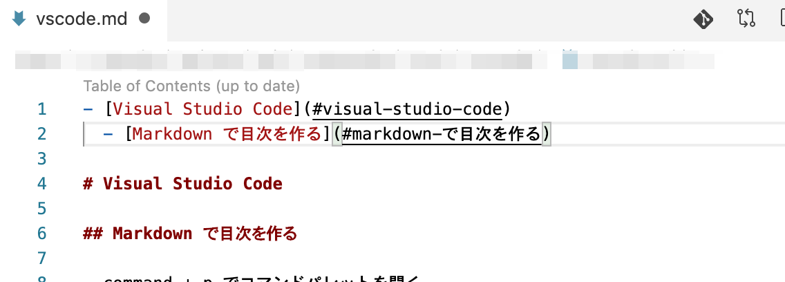

- [Visual Studio Code](#visual-studio-code)
  - [コマンドパレットを開く](#コマンドパレットを開く)
  - [ターミナル](#ターミナル)
    - [ターミナルを開く・閉じる](#ターミナルを開く閉じる)
    - [エディタとターミナル間のフォーカス移動](#エディタとターミナル間のフォーカス移動)
  - [Markdown テキストに目次を挿入する](#markdown-テキストに目次を挿入する)
  - [テキストの差分を確認](#テキストの差分を確認)
    - [ファイルとファイル](#ファイルとファイル)
    - [選択範囲と選択範囲](#選択範囲と選択範囲)
    - [クリップボードと選択範囲](#クリップボードと選択範囲)
    - [クリップボードとファイル](#クリップボードとファイル)

# Visual Studio Code

確認環境
- macOS Majave 10.14.6（18G3020）
- MacBook Pro (13-inch, 2018, Four Thunderbolt 3 Ports)

## コマンドパレットを開く

- `[command] + p` でコマンドパレットが開きます
- 表示されたフォームに `>` を入力すると、機能の検索・実行ができます
- フォームの下には最近開いたファイル名が表示され、これを開くこともできます


## ターミナル
### ターミナルを開く・閉じる

- `[shift] + [control] + @` で画面下にターミナルが表示されます
- もう一度実行すると、ターミナルを隠せます


### エディタとターミナル間のフォーカス移動

- コマンドパレットで `> Open Keyboard Shoutcuts (JSON)` を選択します
- 下記コードをコピー & ペースとし、key の値に任意のショートカットを入力します

```
// `ctrl` + `shift` + `:` でエディタとターミナル間のフォーカス移動
[
    {
        "key": "ctrl+shift+[Quote]",
        "command": "workbench.action.focusActiveEditorGroup",
        "when": "terminalFocus"
    },
    {
        "key": "ctrl+shift+[Quote]",
        "command": "workbench.action.terminal.focus",
        "when": "editorFocus"
    }
]
```

- また、この画面で `[command] + k k ` と入力し、キー入力をすると、key の値の設定できる値を確認できます
  - 例えば、`Control + Shift + :` と入力すると、`ctrl+shift+[Quote]` が表示されます


## Markdown テキストに目次を挿入する

- Markdown テキストを開きます
- Markdown All in One をインストールします
  - https://marketplace.visualstudio.com/items?itemName=yzhang.markdown-all-in-one
- 目次を挿入したい位置でコマンドパレットを開き `> Markdown All in One: Create Table of Contents` を選択します

- 目次が挿入されます



## テキストの差分を確認
- Partial Diff をインストールします
  - https://marketplace.visualstudio.com/items?itemName=ryu1kn.partial-diff

### ファイルとファイル

- エディタでテキスト A とテキスト B を開きます
- テキスト B を開いたエディタを有効にします
- `option` + `control` + `→` を入力すると、エディタが左右に分割され、テキスト B が画面右に配置されます
- エディタ内で右クリック後 `Compare Text in Visible Editors` を選択すると、差分が表示されます
  - 左右どちらのエディタで実行しても、同じ結果になります

### 選択範囲と選択範囲

- テキスト A を選択します
- 右クリック後 `Select Text for Compare` を選択します
- テキスト B を選択します
- 右クリック後 `Compare Text With Previous Selection` を選択すると、差分が表示されます


### クリップボードと選択範囲

- テキスト B をコピーします
- テキスト A を選択します
- 右クリック後 `Compare Text With Clipborad` を選択すると、差分が表示されます


### クリップボードとファイル

- テキスト B をコピーします
- エディタ内でテキストを選択しない状態で、右クリック後 `Compare Text With Clipborad` を選択すると、差分が表示されます

