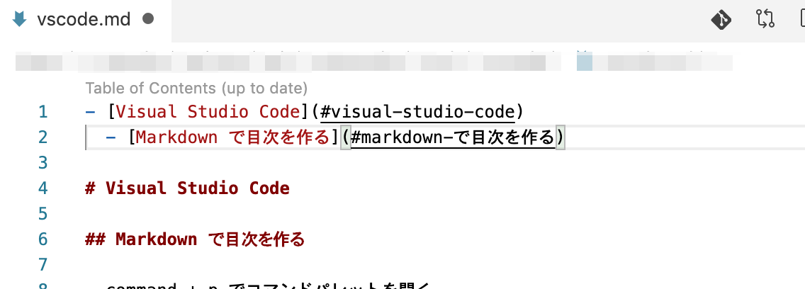

- [Visual Studio Code](#visual-studio-code)
  - [コマンドパレットを開く](#コマンドパレットを開く)
  - [ターミナルを開く・閉じる](#ターミナルを開く閉じる)
  - [Markdown で目次を作る](#markdown-で目次を作る)
  - [エディタとターミナル間のフォーカス移動](#エディタとターミナル間のフォーカス移動)
  - [2 つのファイルの差分を表示する](#2-つのファイルの差分を表示する)
  - [ファイルとクリップボードの差分を比較する](#ファイルとクリップボードの差分を比較する)

# Visual Studio Code

## コマンドパレットを開く

- `command` + `p`
- 過去に編集したファイルを開くことができる


## ターミナルを開く・閉じる

`control` + `shift` + `@` でターミナルの表示/非表示ができます


## Markdown で目次を作る

- コマンドパレットで `> Markdown All in One: Create Table of Contents`を選択




## エディタとターミナル間のフォーカス移動

- コマンドパレットで `> Open Keyboard Shoutcuts (JSON)` を選択
- key にショートカットを入力する。`command` + `k` `command` + `k` で実際のキー入力と key の値の対応を確認できる

```
// `ctrl` + `shift` + `:` でエディタとターミナル間のフォーカス移動
[
    {
        "key": "ctrl+shift+[Quote]",
        "command": "workbench.action.focusActiveEditorGroup",
        "when": "terminalFocus"
    },
    {
        "key": "ctrl+shift+[Quote]",
        "command": "workbench.action.terminal.focus",
        "when": "editorFocus"
    }
]
```

## 2 つのファイルの差分を表示する

## ファイルとクリップボードの差分を比較する
